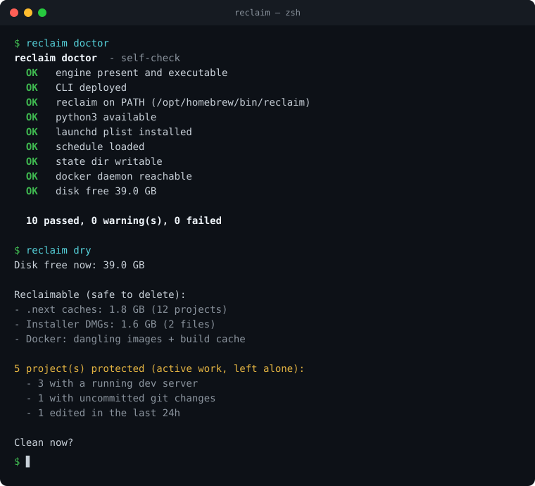
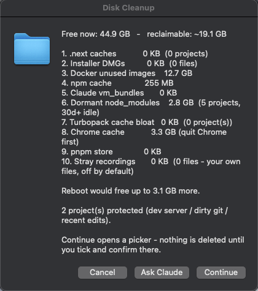
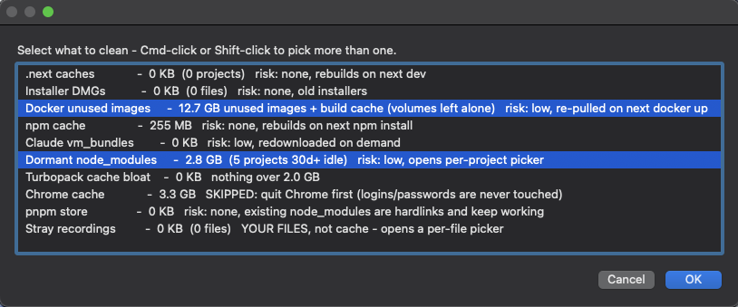

# reclaim

A tiny, process-aware disk and memory janitor for macOS.

`reclaim` is **not** another disk cleaner. It is a small, auditable workspace
agent that happens to clean. Its one rule: **never delete anything you appear to
be actively working on**, and **log every decision** so it is fully auditable.

It runs on a schedule (launchd), pops up an approval dialog, frees only
regenerable caches and junk, shows how much it freed, and records every removed
path in an append-only JSON log.


---

## Why this exists (and why it is not just another cleaner)

Plenty of open-source Mac cleaners exist (PureMac, ClearDisk, mac-ops,
mac-cleaner-cli, macos-cache-cleaner) and they all use launchd - that part is
table stakes, not a feature. The cleaning itself is a commodity.

Three things make `reclaim` different, and the commodity tools genuinely lack
all three:

1. **Active-work awareness.** Before deleting a project's build cache it checks
   whether you are working in that project - a running dev server (`lsof`), a
   dirty git tree, or any file edited in the last 24 hours. If so, it is left
   completely alone. It reads your live workflow before it acts.
2. **Auditable, not a black box.** Every run appends one line to
   `history.jsonl` recording the exact paths removed, their sizes, what was
   protected and why, and real before/after free space. ~250 lines of
   transparent bash, zero telemetry.
3. **It reasons about its own tradeoffs.** For example it deliberately does
   *not* offer Trash-recovery: macOS Trash is on the same volume, so moving a
   cache there frees ~0 bytes until the Trash is emptied, and `.next` caches are
   regenerable so recovery has near-zero value. Trash-recovery would make it
   slower, more complex, and worse at its one job.



> Active-work awareness in a single run: it found 5 projects in use - 3 with a
> live dev server, 1 with uncommitted git changes, 1 edited within the last 24h
> - and left every one of them untouched.

---

## What it cleans (and never touches)

Ten categories, each opt-in, each labelled in the dialog with why it is safe
(or why it is being skipped):

| # | Category | Risk | Why it is safe |
|---|---|---|---|
| 1 | `.next` build caches | none | rebuilt on next `next build` / `pnpm dev` |
| 2 | Installer `.dmg` files | none | app self-updater leftovers |
| 3 | Docker unused images + build cache | low | re-pulled on next `docker compose up`; **volumes never pruned** |
| 4 | npm cache (`~/.npm/_cacache`) | none | pure download cache |
| 5 | Claude `vm_bundles` | low | sandbox VMs, redownloaded on demand; skipped if Claude.app is running |
| 6 | Dormant `node_modules` (30d+ idle) | low | per-project picker; `pnpm install` to restore |
| 7 | Ballooned Turbopack dev caches | none | costs one slow rebuild; never touched while that dev server runs |
| 8 | Chrome cache | none | `~/Library/Caches/Google` only - **logins and passwords are never touched** |
| 9 | pnpm store | none | `pnpm store prune`; existing `node_modules` are hardlinks and keep working |
| 10 | Stray recordings (200 MB+, 30d+) | **your call** | your own files, not caches - never ticked by default |

**Never touches:**
- Any project with a running dev server, a dirty git tree, or a file edited in
  the last 24h (configurable via `PROTECT_HOURS`)
- Chrome profiles - cookies, sessions and saved passwords live in
  `Application Support/Google` and are out of scope by design. Only the cache
  directory is ever offered, and only once Chrome is quit.
- Cloud-only files (Google Drive 0-byte placeholders)
- Docker **volumes** (they can hold project databases)
- Anything outside the explicit safe categories above

It also **reports without deleting**: how much a reboot would likely free
(`/private/var/folders` plus local APFS snapshots), and - if Docker Desktop is
not running - it offers to start it and rescan, since Docker's disk image is
often the single biggest reclaimable item and is invisible while the daemon is
down.

Space freed is always measured from real `df` before/after, never estimated.

---

## Why category 7 exists: the cache the safety rule was hiding

Active-work protection has a blind spot, and finding it is what produced the
biggest single win the tool has ever reported.

Next.js 16 keeps a **persistent** Turbopack cache at `.next/dev/cache/turbopack`
- an LSM key-value store, the same shape as RocksDB: `.sst` segments that are
appended on every rebuild. It survives restarting the dev server on purpose,
because that is what makes cold starts fast. But compaction does not reliably
retire the old segments, so the directory only grows.

One project had been running a dev server continuously for ten days. Its cache
held **2,597 segment files totalling 9.4 GB**, several of them over 270 MB.
Because that project had a live dev server, active-work protection was
correctly refusing to touch its `.next` at all - so the single biggest
reclaimable thing on the disk was the one thing the safety rule guaranteed
would never be reported.

The fix keeps the safety rule intact and reports around it. For projects that
protection skips, reclaim now measures the Turbopack cache separately and, above
`TURBO_MIN_KB`, offers *only that directory* rather than the whole `.next`. If
the blocker is a running dev server it is listed but not deletable - you get
told exactly which server to stop - and the check is repeated at delete time,
not just at scan time, so a server started mid-run cannot lose its open store.

Two things worth noting, because they change what you should do about it:
stopping your dev servers does **not** shrink this cache (it is persistent by
design), and the growth is per-rebuild rather than per-run. Deleting it costs
exactly one slow rebuild.

---

## Install

```sh
git clone https://github.com/hanna-fmw/reclaim.git
cd reclaim
./install.sh
```

This deploys the scripts to `~/.disk-cleanup/`, symlinks the `reclaim` CLI onto
your PATH, and loads the launchd schedule. To remove everything:

```sh
./uninstall.sh
```

The cloned folder is the **source of truth**. Edit here, then re-run
`./install.sh` to redeploy. Runtime state (`history.jsonl`, `last-run`) lives in
`~/.disk-cleanup/` and is not part of the repo.

---

## Usage

```
reclaim clean          scan, then pop up the approval dialog
reclaim clean -y       clean all safe items immediately, no dialog
reclaim scan           notify how much is cleanable (deletes nothing)
reclaim dry            print the plan (no dialog, no delete)
reclaim history        table of past runs + space freed
reclaim history clear  archive + reset the log
reclaim stats          lifetime totals
reclaim trend          regrowth rate + forecast from the audit log
reclaim top            live scan of your biggest space users
reclaim doctor         self-check: install, PATH, schedule, deps
reclaim status         schedule state, last run, free space
reclaim ram            top memory hogs + Chrome tab breakdown
reclaim monitor        text Activity Monitor: CPU, memory, swap (with lag warning)
reclaim monitor --free pick heavy apps to quit and free memory
reclaim enable/disable turn the schedule on/off
reclaim help           this
```

### The approval dialog
On a scheduled or manual run it shows an overview - free space, the
per-category breakdown, which projects are protected and why, and what a reboot
would free - with three buttons:
- **Continue** - opens a picker; the safe categories come preselected, the
  judgement calls do not. Cmd-click or Shift-click to select several. Nothing
  is deleted until you confirm there.
- **Ask Claude** - opens a terminal in the repo with the plan and an
  interactive Claude session, for when you want a second opinion before
  deleting something
- **Cancel** - do nothing (logged as a skip)

Picking dormant `node_modules` or stray recordings opens a second, per-item
picker so you approve each path individually.



A real run: 19.1 GB reclaimable across ten categories, each with its size and
its caveat inline - Chrome asking to be quit first, recordings flagged as your
own files and off by default, two projects protected as active work, and the
reboot gain reported separately because reclaim will not delete it for you.



The picker carries the same reasoning down to the row level, so the decision is
made where the click happens rather than in a manual: what each item costs to
lose, which ones are being skipped and why (`SKIPPED: quit Chrome first`), and
which open a further per-item picker before anything is removed.

---

## Schedule

The launchd agent (`dev.reclaim.plist`, label `dev.reclaim`) fires daily at **08:45**. The
script holds a **3-day gate** (`INTERVAL_DAYS=3`), so it only actually acts
every ~3 days. If the Mac is asleep at 08:45, macOS runs it on next wake.
Running `reclaim` manually always bypasses the gate.

---

## The audit log

`~/.disk-cleanup/history.jsonl` - one JSON object per run. Example clean entry:

```json
{"ts":"2026-06-01T08:45:03Z","action":"clean","freed_kb":12345678,
 "cleaned":{"next":1,"dmg":1,"docker":1,"npm":1,"claudevm":0,"dormant":1,
            "turbopack":1,"chrome":0,"pnpm":1,"media":0},
 "next_dirs":12,"dmgs":2,"dormant_count":5,"turbo_count":1,"turbo_blocked":2,
 "protected":{"running":5,"dirty":1,"recent":2},"free_after_kb":45000000,
 "removed":[{"path":"/Users/.../foo/.next","kb":810240}, ...]}
```

`turbo_blocked` is the count of ballooned Turbopack caches that were found but
left alone because their dev server was still running - the log records what was
*not* cleaned and why, not just what was.

**Measured, not estimated.** Docker is the awkward case: its own `Reclaimable`
column counts an image as reclaimable even while a container still references
it, and `prune -af` will not remove those. Reported naively it promises many GB
and then frees nothing, which is the worst possible behaviour for a tool asking
you to approve deletions.

So the headline number is what a prune can actually remove right now - build
cache plus unreferenced images - with the optimistic figure kept as a clearly
labelled ceiling: `0 KB … 14 image(s) are in use by containers and stay; up to
11.5 GB if you stop them first`. The log then records Docker's measured
before/after delta rather than either estimate, keeping the prediction alongside
as `estimated_kb` so the two can be compared after the fact.

If you pick Docker while the daemon is down, it says so and offers to start
Docker Desktop rather than silently doing nothing.

This is the "git for data" flat-file approach: append-only, greppable, and
git-trackable if you choose to version it.

---

## File layout

```
reclaim/
  cleanup.sh                    core engine (scan, protect, dialog, clean, log)
  reclaim                       CLI front-end
  dev.reclaim.plist  launchd schedule (daily 08:45)
  install.sh                    deploy to ~/.disk-cleanup + symlink + load launchd
  uninstall.sh                  unload + remove symlink
  README.md
  LICENSE
```

Deployed runtime (created by install.sh):
```
~/.disk-cleanup/
  cleanup.sh, reclaim           deployed copies
  history.jsonl                 audit log (runtime state)
  last-run                      epoch of last real run (drives the 3-day gate)
~/Library/LaunchAgents/dev.reclaim.plist
/opt/homebrew/bin/reclaim       symlink onto PATH
```

---

## Configuration

Edit the constants at the top of `cleanup.sh`:
- `INTERVAL_DAYS` - days between scheduled actions (default 3)
- `PROTECT_HOURS` - "recently edited" protection window (default 24)
- `DORMANT_DAYS` - idle window before `node_modules` counts as dormant (default 30)
- `RECLAIM_ROOTS` (env) - space-separated folders scanned for projects (`.next` caches, dormant `node_modules`). Default: every visible folder in your home except Library, Applications, Movies, Music, Pictures, Downloads and Public
- `DOCKER_TIMEOUT` (env) - seconds any Docker call may take before reclaim gives up on it (default 20), so a stuck Docker never hangs a scan
- `DMG_DIR` - directory swept for installer `.dmg` files
- `TURBO_MIN_KB` - size a Turbopack cache must exceed to be offered (default 2 GB)
- `MEDIA_MIN_KB` / `MEDIA_AGE_DAYS` - size and age thresholds for stray
  recordings (default 200 MB, 30 days)
- `MEDIA_DIRS` - directories swept for stray recordings

`TURBO_MIN_KB`, `MEDIA_MIN_KB` and `MEDIA_AGE_DAYS` also read from the
environment, so you can test a detector without editing the file:

```sh
TURBO_MIN_KB=10000 MEDIA_MIN_KB=1024 MEDIA_AGE_DAYS=0 reclaim dry
```

To change the schedule time, edit `StartCalendarInterval` in the plist and
re-run `./install.sh`.

---

## Requirements

macOS, `bash` 3.2+ (system default), `python3` (system default), and optionally
Docker (the Docker step is skipped silently if the daemon is not running).
